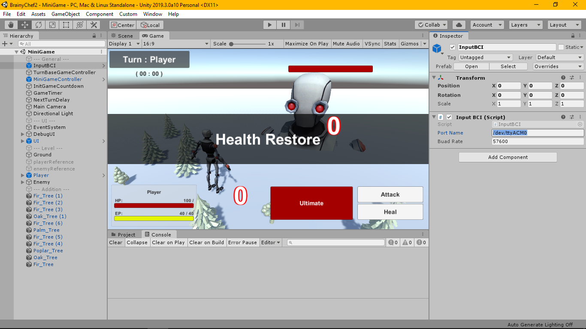

# BrainyChef
- Simple turn based game with BCI

# Video
- [links](https://youtu.be/15v5o27n-p4)

# Dependencies
- EEG Headset : Mindwave Mobile 1 ([Device](https://store.neurosky.com/))
- Arduino with Bluetooth module
- [Mindwave (library)](https://github.com/orgicus/Mindwave)
- Unity (atleast v.2019.3.0a10)

# Getting Started
1. Open file [Game Protocol](Arduino/BCI_game_protocol1.5_edit.ino) in the Arduino IDE
2. Include Mindwave Library
3. Compile (Verify) a game protocol script
4. Open Unity Project
5. Change "Port Name" and "Buad Rate" to match the setting in the Arduino IDE

6. Build and Run the project

# Issue
 - Attempts to view Serial port Monitor in Arduino IDE may prevent the Game to connect to the Arduino, Please close the Serial port Monitor before Starting the game.
